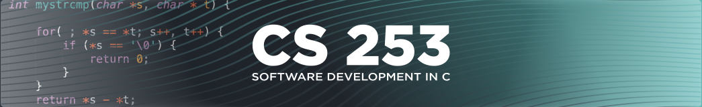

# Module 4 Lab Guide
[Lab Introduction Video](https://boisestate.hosted.panopto.com/Panopto/Pages/Viewer.aspx?id=71c4fc21-237c-4944-935d-b00e01765afc)  


### Code Style Requirements
Please review the [CS253 Style Guide](https://docs.google.com/document/d/1zKIpNfkiPpDHEvbx8XSkZbUEUlpt8rnZjkhCSvM-_3A/edit?usp=sharing) and apply it in all lab warmups, lab activities and projects this semester. Coding Style will assessed as part of your lab and project grades.

### Code Quality Requirements
- Code must compile without warnings using the provided Makefile
- Programs must handle unexpected user input and either reprompt (loops) or gracefully exit with a non-zero exit status.
- Programs must handle error conditions gracefully, without crashing, ideally by checking the returns codes (if available) and returning a non-zero exit status.
- Programs should be free of memory related errors, buffer overflows, stack smashing, etc... Whether the program crashes or not.

## Lab Warmup - Service Station
[Walkthrough Video](https://boisestate.hosted.panopto.com/Panopto/Pages/Viewer.aspx?pid=445363af-c064-4383-8056-b01201726d67)  

### Problem Description
<br />
1. Prompt the user for an automobile service. Each service type is composed of two words and can be processed as either two separate strings or as a single string (see scanf manpage). Output the user's input.
<br />

#### Expected Program Output (with sample user input)
```
Enter desired auto service:
Oil change
You entered: Oil change
```
<br />
2. Output the price of the requested service.
<br />

#### Expected Program Output (with sample user input)
```
Enter desired auto service:
Oil change
You entered: Oil change
Cost of oil change: $35
```
<br />
The program should support the following services:

- Oil change -- $35
- Tire rotation -- $19
- Car wash -- $7


### Error Handling
The following describes the expected behavior in the event of unexpected user input
- If the user input exceeds 40 characters for either field, only match the first 40 characters and truncate the remainder
- If the user input does not match the expected pattern, display the following and exit immediately with a non-zero exit status  
```
Error: Unable to parse input
```
- If the user enters a service that is not listed above, display the following and exit immediately with a non-zero exit status  
```
Error: Requested service is not recognized
```

### Implementation Guide
1. Expand the folder named LabWarmup and open the file named main.c
2. Enter the program code to create an application as described in the Problem Description.
3. Test the program using the above examples to ensure it functions as expected.
4. Commit the changes to your local repository with a message stating that LabWarmup is completed.
5. Push the changes from your local repository to the github classroom repository.
6. Update the Coding Journal with an entry describing your experience using the steps outlined below.


## Lab Activity - Service Invoices
### Problem Description

<br />
1. Output a menu of automotive services and the corresponding cost of each service.

#### Expected Program Output
```
Davy's auto shop services
Oil change -- $35
Tire rotation -- $19
Car wash -- $7
Car wax -- $12

```
<br />
2. Prompt the user for two services. Each service type is composed of two strings. 
<br />

#### Expected Program Output (with sample user input)
```
Select first service:
Oil change
Select second service:
Car wax

```
<br />
3. Output an invoice for the services selected. Output the cost for each service and the total cost. 
<br />

#### Expected Program Output (with sample user input from above)
```
Davy's auto shop invoice

Service 1: Oil change, $35
Service 2: Car wax, $12

Total: $47

```
<br />
4. Extend the program to allow the user to enter a dash (-), which indicates no service. The dash may be entered as either the first or second service.
<br />

#### Expected Program Output (with sample user input)
```
Davy's auto shop services
Oil change -- $35
Tire rotation -- $19
Car wash -- $7
Car wax -- $12

Select first service:
Tire rotation
Select second service:
-

Davy's auto shop invoice

Service 1: Tire rotation, $19
Service 2: No service

Total: $19

```
<br />

### Error Handling
The following describes the expected behavior in the event of unexpected user input
- If the user input exceeds 40 characters for either word field, or 80 characters if using a single buffer for the service, truncate the remainder
- If the user input does not match the expected pattern, display the following and exit immediately with a non-zero exit status  
```
Error: Unable to parse input
```
- If the user enters a service that is not listed in the menu (except for - ), display the following and exit immediately with a non-zero exit status  
```
Error: Requested service is not recognized
```

### Implementation Guide
1. Expand the folder named LabActivity and open the file named main.c
2. Enter the program code to create an application as described in the Problem Description.
3. Test the program using the provided [Lab Activity Test Plan](LabActivityTestPlan.md) to ensure it functions as expected.
4. Commit the changes to your local repository with a message stating that LabActivity is completed.
5. Push the changes from your local repository to the github classroom repository.
6. Update the Coding Journal with an entry describing your experience using the steps outlined below.

## Coding Journal (Optional)
Keep a journal of your activities as you work on this lab. Many of the best engineers that I have worked with professionally have kept some sort of engineering journal. I personally packed notebooks around with me for nearly 8 years before I began keeping my notes electronically.   

Your journal can track ideas, bugs, cool links, code snippets, shell commands, rants, or simply a reflection on what worked well or not-so-well with this lab activity. I will not be grading the content of your journal, but I will expect at least two timestamped journal entries of at least a 75 to 150 words each added to the provided Journal.md file.  The purpose of this component is to help develop the habit of taking notes and creating documentation while you code. The more detail you provide the better as that will help you if you ever need to refer back to this project in the future.

## Markdown Resources
Markdown is a notation that is used to format text documents.  It is widely used in Software Development shops around the world, which is why we're asking you to use it in your lab documentation.  

Github provides a guide for getting started:  [Mastering Markdown](https://guides.github.com/features/mastering-markdown/)
