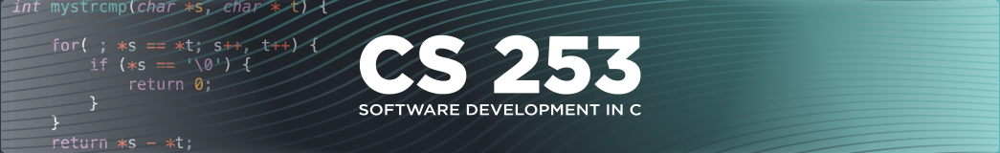

# Module 5 Lab Guide
[Lab Introduction Video](https://boisestate.hosted.panopto.com/Panopto/Pages/Viewer.aspx?id=04b6f464-5fa2-41e1-8933-b00f000ac487)  


### Code Style Requirements
Please review the [CS253 Style Guide](https://docs.google.com/document/d/1zKIpNfkiPpDHEvbx8XSkZbUEUlpt8rnZjkhCSvM-_3A/edit?usp=sharing) and apply it in all lab warmups, lab activities and projects this semester. Coding Style will assessed as part of your lab and project grades.

### Code Quality Requirements
- Code must compile without warnings using the provided Makefile
- Programs must handle unexpected user input and either reprompt (loops) or gracefully exit with a non-zero exit status.
- Programs must handle error conditions gracefully, without crashing, ideally by checking the returns codes (if available) and returning a non-zero exit status.
- Programs should be free of memory related errors, buffer overflows, stack smashing, etc... Whether the program crashes or not.

## Lab Warmup - Draw a triangle
[Walkthrough Video](https://boisestate.hosted.panopto.com/Panopto/Pages/Viewer.aspx?pid=5ac6059f-9111-4865-bdd0-b012017593fa)  

### Problem Description

This program will output a right triangle based on user specified height triangleHeight and symbol triangleChar. 

<br />
1. The given program outputs a fixed-height triangle using a * character. Modify the given program to output a right triangle that instead uses the user-specified triangleChar character.  

<br />
<br />
2. Modify the program to use a nested loop to output a right triangle of height triangleHeight. The first line will have one user-specified character, such as % or *. Each subsequent line will have one additional user-specified character until the number in the triangle's base reaches triangleHeight. Output a space after each user-specified character, including after the line's last user-specified character.  

<br />


#### Expected Program Output (with sample user input)
```
Enter a character:
%
Enter triangle height:
5

% 
% % 
% % % 
% % % % 
% % % % % 
```
### Error Handling
The following describes the expected behavior in the event of unexpected user input
- If the user input for triangle height is not an integer, display the following and exit immediately with a non-zero exit status  
```
Error: Unrecognized input, please enter only integer values.
```

### Implementation Guide
1. Expand the folder named LabWarmup and open the file named main.c
2. Enter the program code to create an application as described in the Problem Description.
3. Test the program using the above example to ensure it functions as expected.
4. Commit the changes to your local repository with a message stating that LabWarmup is completed.
5. Push the changes from your local repository to the github classroom repository.  


## Lab Activity - Draw a half arrow
### Problem Description

This program outputs a downwards facing arrow composed of a rectangle and a right triangle. The arrow dimensions are defined by user specified arrow base height, arrow base width, and arrow head width.  

<br />
1. Run the following commands to generate the baseline assembly code for this activity  

```
make myprog-v2
mv myprog.s myprog-baseline.s
```
<br />
2. Modify the given program to use a loop to output an arrow base of height arrowBaseHeight.  

<br />
<br />
3. Modify the given program to use a loop to output an arrow base of width arrowBaseWidth. Use a nested loop in which the inner loop draws the *’s, and the outer loop iterates a number of times equal to the height of the arrow base.  

<br />
<br />
4. Modify the given program to use a loop to output an arrow head of width arrowHeadWidth. Use a nested loop in which the inner loop draws the *’s, and the outer loop iterates a number of times equal to the height of the arrow head. 

<br />
<br />
5. Modify the given program to only accept an arrow head width that is larger than the arrow base width. Use a loop to continue prompting the user for an arrow head width until the value is larger than the arrow base width. 

```
while (arrowHeadWidth <= arrowBaseWidth) {
    // Prompt user for a valid arrow head value
}
```

<br />

#### Expected Program Output (with sample user input)
```
Enter arrow base height:
5
Enter arrow base width:
2
Enter arrow head width:
4

**
**
**
**
**
****
***
**
*
```
<br />
6. Run the following command to regenerate the assembly code for the final solution

```
make myprog-v2
```
<br />
7. Compare myprog-baseline.s with the newly generated myprog.s. Update the Coding Journal with your observations from comparing the assembly code before and after adding loops. What differences do you see? What stands out?
<br />
<br />

### Error Handling
The following describes the expected behavior in the event of unexpected user input
- If the user input for any of the three fields is not an integer, display the following and exit immediately with a non-zero exit status  
```
Error: Unrecognized input, please enter only integer values.
```

### Implementation Guide
1. Expand the folder named LabActivity and open the file named main.c
2. Enter the program code to create an application as described in the Problem Description.
3. Test the program using the provided [Lab Activity Test Plan](LabActivityTestPlan.md) to ensure it functions as expected.
4. Commit the changes to your local repository with a message stating that LabActivity is completed.
5. Push the changes from your local repository to the github classroom repository.
6. Update the Coding Journal with your observations from comparing the assembly code before and after adding loops

## Coding Journal (Optional)
Keep a journal of your activities as you work on this lab. Many of the best engineers that I have worked with professionally have kept some sort of engineering journal. I personally packed notebooks around with me for nearly 8 years before I began keeping my notes electronically.   

Your journal can track ideas, bugs, cool links, code snippets, shell commands, rants, or simply a reflection on what worked well or not-so-well with this lab activity. I will not be grading the content of your journal, but I will expect at least two timestamped journal entries of at least a 75 to 150 words each added to the provided Journal.md file.  The purpose of this component is to help develop the habit of taking notes and creating documentation while you code. The more detail you provide the better as that will help you if you ever need to refer back to this project in the future.

## Markdown Resources
Markdown is a notation that is used to format text documents.  It is widely used in Software Development shops around the world, which is why we're asking you to use it in your lab documentation.  

Github provides a guide for getting started:  [Mastering Markdown](https://guides.github.com/features/mastering-markdown/)
